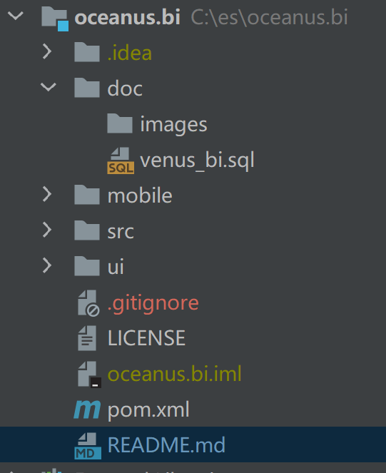
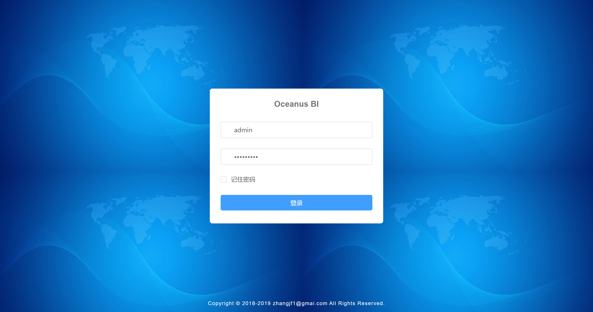
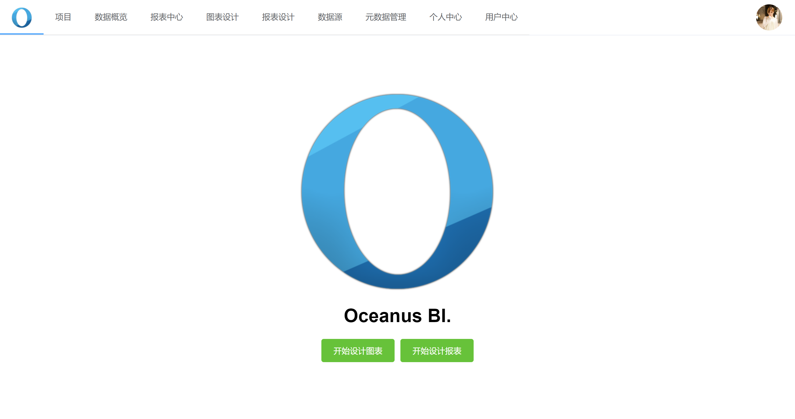
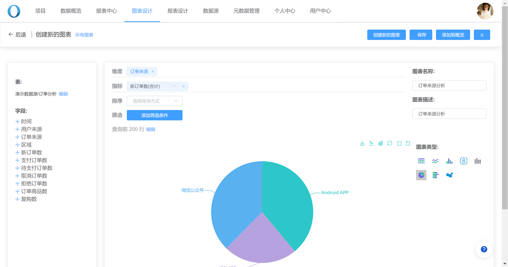
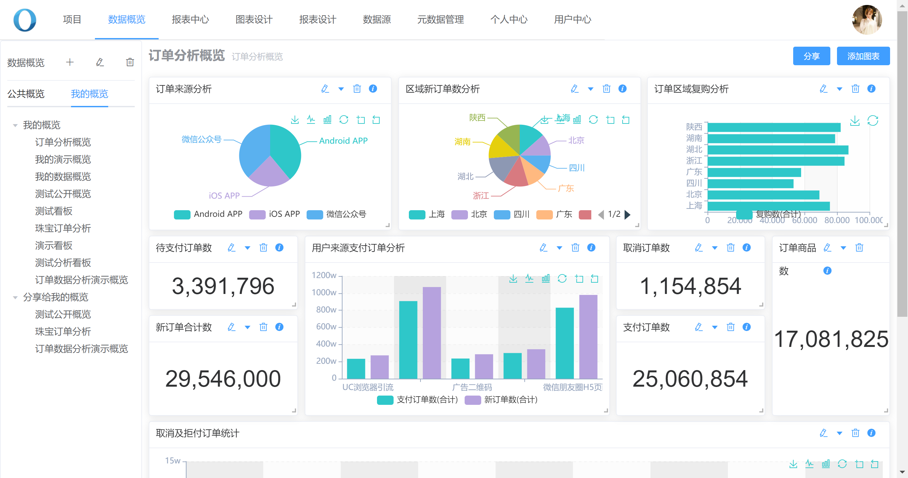
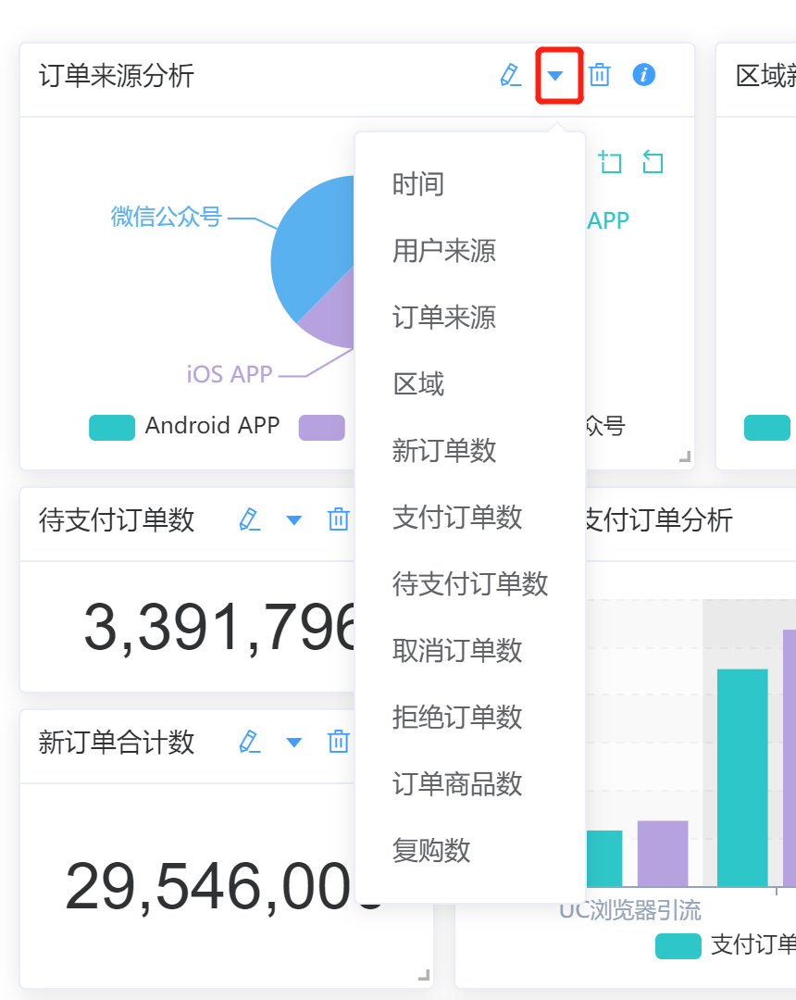
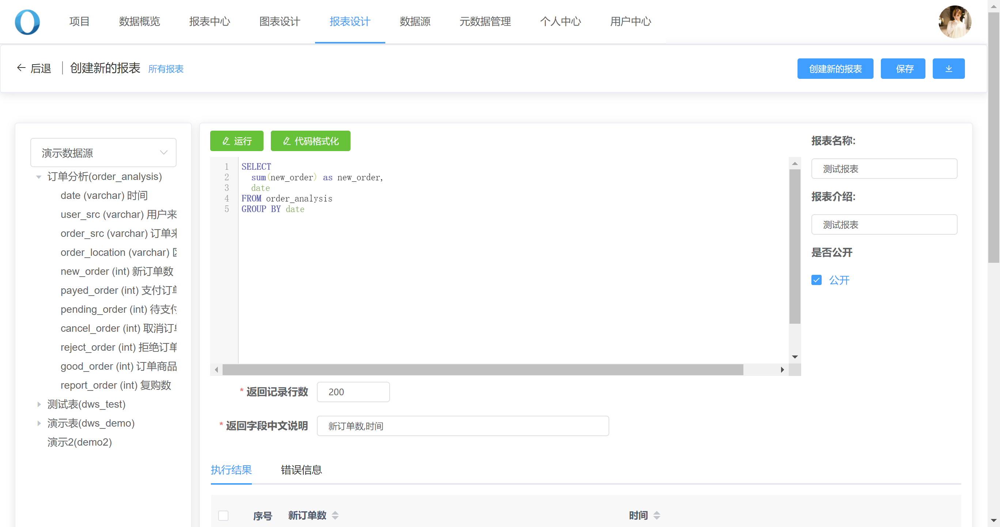
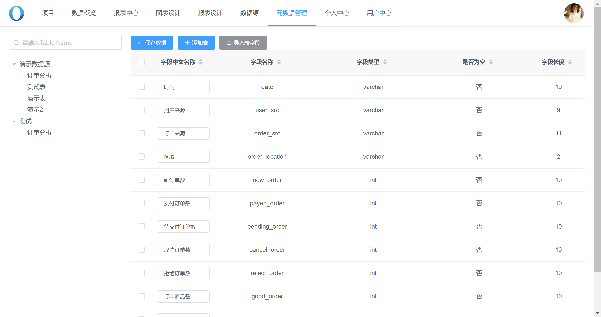

# 介绍

这是一个可自由拖拽的BI可视化系统

支持主流的关系数据：MySQL，Oracle，PostgreSQL等

同时支持Apache Doris，这个一开始初衷就是为了 Doris 数据可视化分析做的

后端框架使用了若依


## 功能

1. 按项目管理数据看板
2. 看板具备分享功能
3. 可以自由拖拽实现数据看板
4. 自由拖拽实现图表开发
5. 提供数据报表开发工具
6. 提供sql开发控制台
7. 数据下钻（按维度下钻）
8. 数据源管理
9. 元数据管理
10. 用户管理

目录结构：



mobile ：手机端，手机端只是查看，不具备设计功能

ui：pc端

doc：这里是数据库脚本

# 编译

```
进入到前端页面目录（ui,mobile）
npm install

npm run dev

npm run build
```

# 系统截图

## 登录界面



默认用户名密码：admin/123456

## 首页



## 图表设计



## 数据看板



## 数据下钻



## 数据报表设计



## 元数据管理


